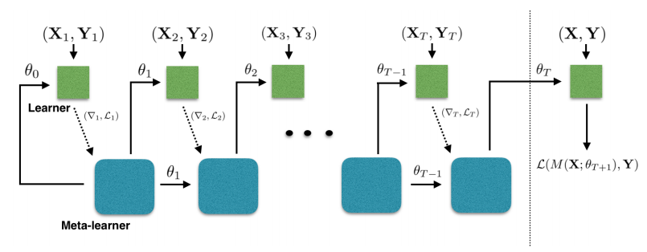
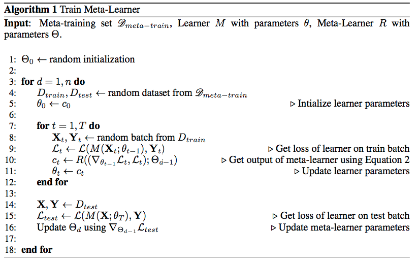

# Model-Optimization-for-few-shot-learning

This is the implementation of Paper Optimization as a model for few-shot learning in pytorch

## Motivation

1. Gradient-based algorithms are not designed for a limited number of updates. specifically when the objective function is non-convex (which only has a local optimum solution).
2. Due to the random initialization of parameters, a limited number of updates will not lead to the optimal solution. (Using pre-trained network parameters greatly reduces the accuracy of the network as the trained task diverges from the target task)

## This paper solves the problem in two levels using Meta learning

The first is the quick acquisition of knowledge within each separate task presented. This process is guided by the second, which involves a slower extraction of information learned across all the tasks.

## Important points from the Paper
1. we leverage that gradient descent update resembles the update for the cell state in an LSTM.
2. Avoiding batch normalization during meta testing
3. preprocessing method of Andrychowicz et al. (2016) worked well when applied to both the dimensions of the gradients and the losses at each time step.
4. We set the cell state of the LSTM to be the parameters of the learner, or ct = θt

## Hence the name meta-learner LSTM.
💡 Learner and the meta-learner are two different things. The learner is a neural network classifier and meta-learner LSTM is an optimizer trained to optimize a learner similar to the cell state update of LSTM

1. Here the output produced by the meta-learner is again used by the learner and the meta-learner in the next iteration. Hence the two arrows from meta-learner.
2. The dashed line indicates that the gradient of loss function of learner parameters is used in the meta-learner output equation.

### Lines 1—>5

1. Random initialization of meta-learner parameters ( Initialize the cell state of the metalearner with the parameters of the Learner Network)
2. Iterate for the data sets in the meta-train
3. Randomly pick D_train and D_test from the meta-train
4. Initialize the learner parameters

### Lines 7—>12

1. Start training on D_train randomly pick a batch from (D_train)
2. calculate Loss using the initialized learner parameters
3. Calculate the learner parameters by leveraging the LSTM cell update.

### Lines 14—>16

1. Calculate the loss on the (D_test) using the updated learner parameters 
2. Update the meta-learner parameters using gradient descent

### Methods followed while training
1. Parameter sharing
2. Avoiding batch normalization during meta testing

## Data Preparation

### Class Create episode() 
[ Reading the images from each folder separately using ImageDataset Class]
In each episode n_shot + n_eval = batch_size images are being read
### Class ImageDataset
ImageDataset is called in create episode called for reading images 
in each folder
### Class EpisodicSampler
Episode sampler is used as a batch sampler while loading data
BatchSampler takes indices from your Sampler() instance (in this case 3 of them) and returns it as list so 
those can be used in your MyDataset __getitem__ method

#### PS:- I did not train as I my PC do not have enough capability to run this.
If you have any doubts contact me : vikramreddy0307@gmail.com
